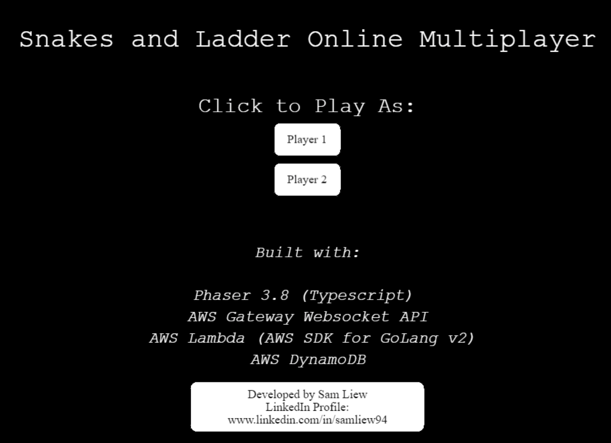
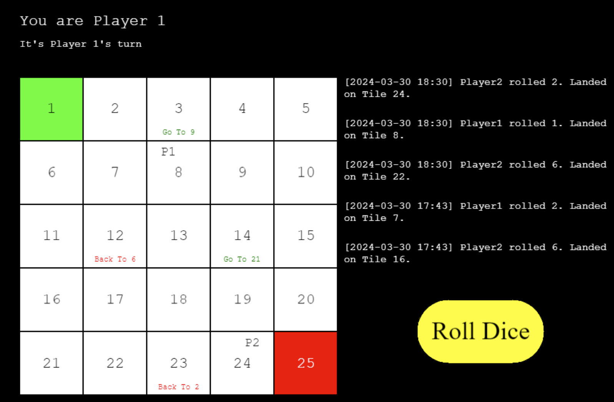

# Snakes and Ladder - Multiplayer
## Techstack
1. Phaser 3.8 (_Typescript_)
2. AWS API Gateway Websocket API
3. AWS Lambda (_AWS SDK GoLang V2_)
4. AWS DynamoDB

## Constraints
1. Only 2 players/connection at any given time.
2. To play as both players, open a new tab.

## /client
Stores Phaser code written in Typescript

## /server
Each subfolder represents a lambda code written in Go.  
All info like player name, position and whose turn it is stored in DynamoDB - read/write using AWS SDK Go V2 package/code.  

# Screenshots

